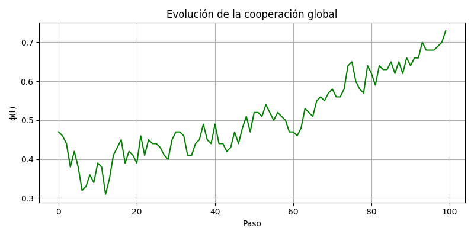
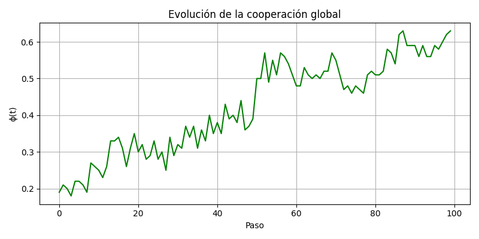
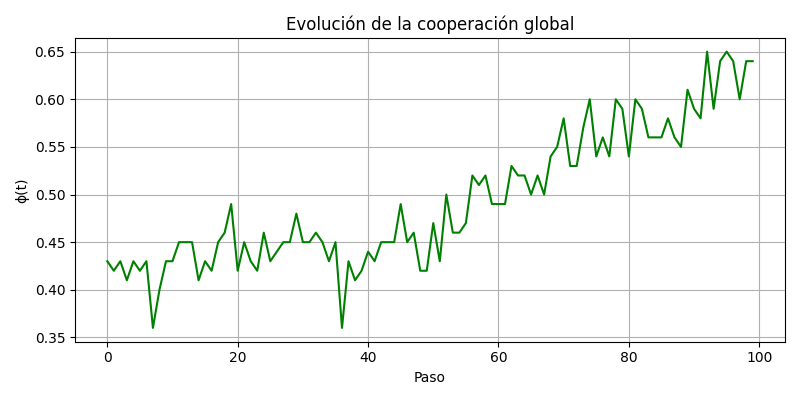

# Trabajo de Fin de Grado - Ingeniería Matemática - Simulación de Agentes Fenotipos

El enlace al repositorio de este artículo es el siguiente: [GitHub](https://github.com/MiguelGG03/TFG_SimulacionAgentesFenotipos.git)

Se trata de un repositorio cuya finalidad es simular una población dividida en vecindarios donde conviven agentes con diferentes tipos de fenotipos conductuales y cuyas interacciones están basadas en juegos estáticos de la Teoría de Juegos

### Índice

- [Parámetros Normales](#parametros-normales)  
  - [SIM1](#sim1)  
  - [SIM2](#sim2)

- [Otros Parámetros](#otros-parámetros)  
  - [Distribuciones igualitarias](#distribuciones-igualitarias)  
    - [Simulación 1](#simulación-1)  
    - [Simulación 2](#simulación-2)  
    - [Simulación 3](#simulación-3)  
    - [Simulación 4](#simulación-4)  
  - [Distribuciones mayoritarias](#distribuciones-mayoritarias)  
    - [40% Mayoritarios](#40-mayoritarios)  
      - [Aleatorio](#aleatorio)  
      - [Altruista](#altruista)  
      - [Envidioso](#envidioso)  
      - [Optimista](#optimista)  
      - [Pesimista](#pesimista)  
    - [60% Mayoritarios](#60-mayoritarios)  
      - [Aleatorio](#aleatorio-1)  
      - [Altruista](#altruista-1)  
      - [Envidioso](#envidioso-1)  
      - [Optimista](#optimista-1)  
      - [Pesimista](#pesimista-1)

- [Parámetros K1 y K2](#parámetros-k1-y-k2)  
  - [K1](#k1)  
    - [K1_005](#k1_005)  
    - [K1_030](#k1_030)  
    - [K1_060](#k1_060)  
  - [K2](#k2)  
    - [K2_005](#k2_005)  
    - [K2_030](#k2_030)  
    - [K2_060](#k2_060)

## Simulación

Hemos hecho diversos tipos de simulaciones para poder sacar conclusiones [...]

### Parametros Normales

#### SIM1

#### SIM2

### Otros Parámetros

#### Distribuciones igualitarias

Se distribuyen todos los fenotipos al 20%

##### Simulación 1

##### Simulación 2

##### Simulación 3

##### Simulación 4

#### Distribuciones mayoritarias

##### 40% Mayoritarios

###### Aleatorio

###### Altruista

###### Envidioso

###### Optimista

###### Pesimista

##### 60% Mayoritarios

###### Aleatorio

###### Altruista

###### Envidioso

###### Optimista

###### Pesimista

#### Parámetros K1 y K2

##### K1

###### K1_005

- **SIM1**

  
  
  
  

- **SIM2**

  
  
  
  

- **SIM3**

  
  
  
  

###### K1_030

- **SIM1**

  

  
  

- **SIM2**

  
  
  
  

- **SIM3**

  
  
  
  

###### K1_060

- **SIM1**

  
  
  
  

- **SIM2**

  
  
  
  

- **SIM3**

  
  
  
  

##### K2

###### K2_005

- **SIM1**

  
  
  
  

- **SIM2**

  
  
  
  

- **SIM3**

  
  
  
  

###### K2_030

- **SIM1**

  
  
  
  

- **SIM2**

  
  
  
  

- **SIM3**

  
  
  
  

###### K2_060

- **SIM1**

  
  
  
  

- **SIM2**

  
  
  
  

- **SIM3**

  
  
  
  

